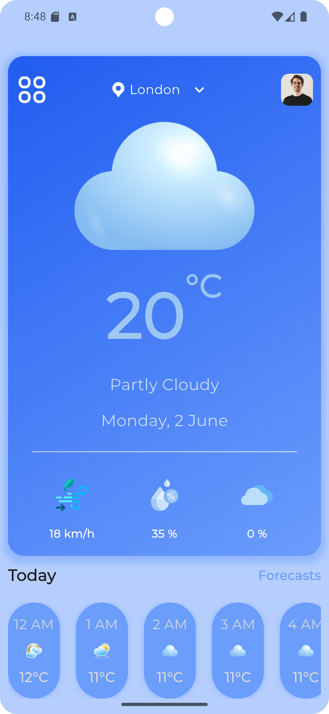
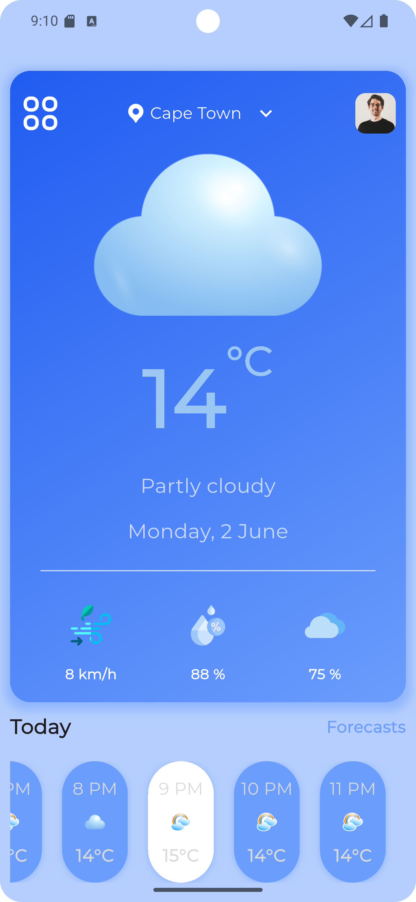
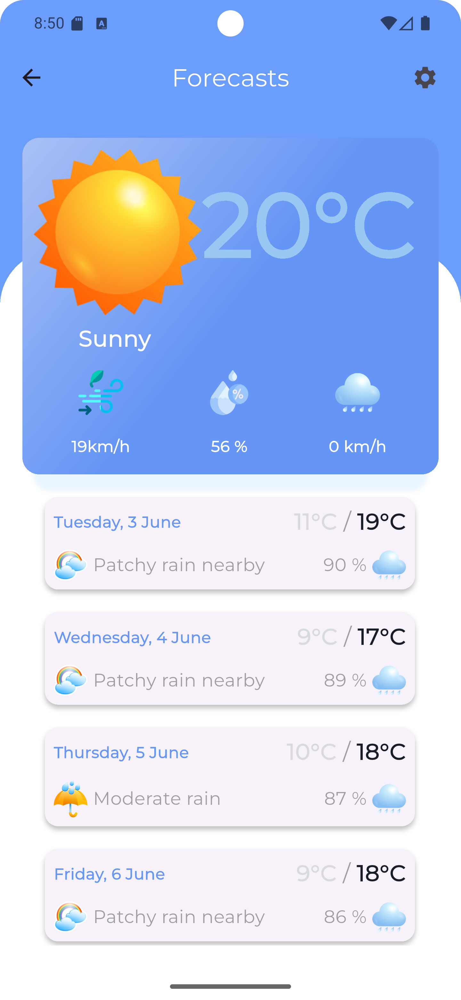
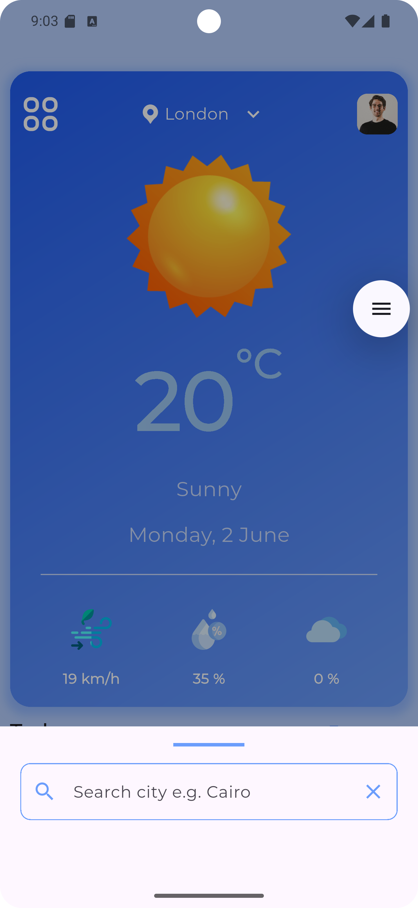
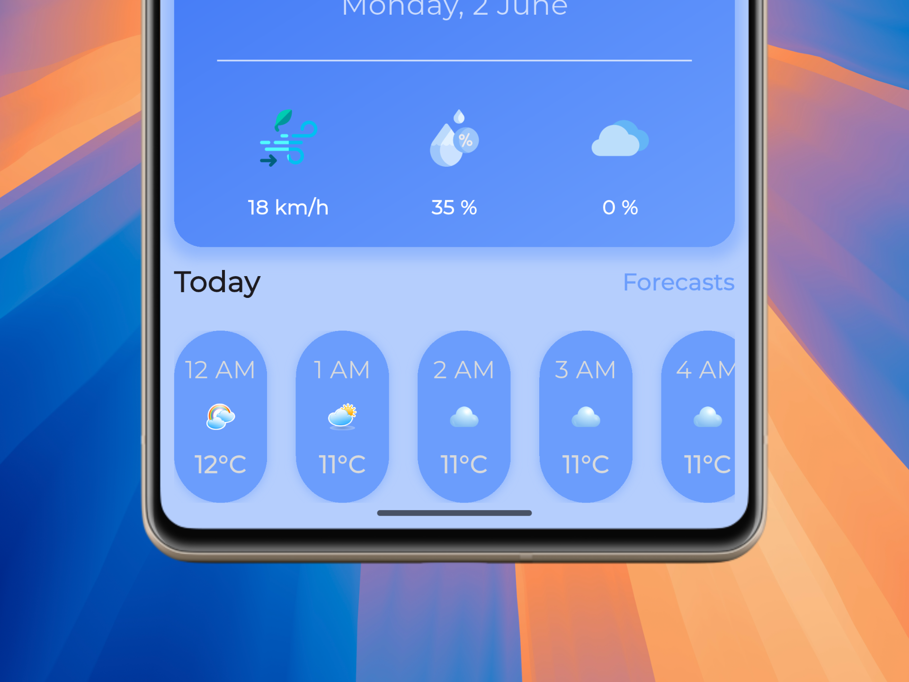
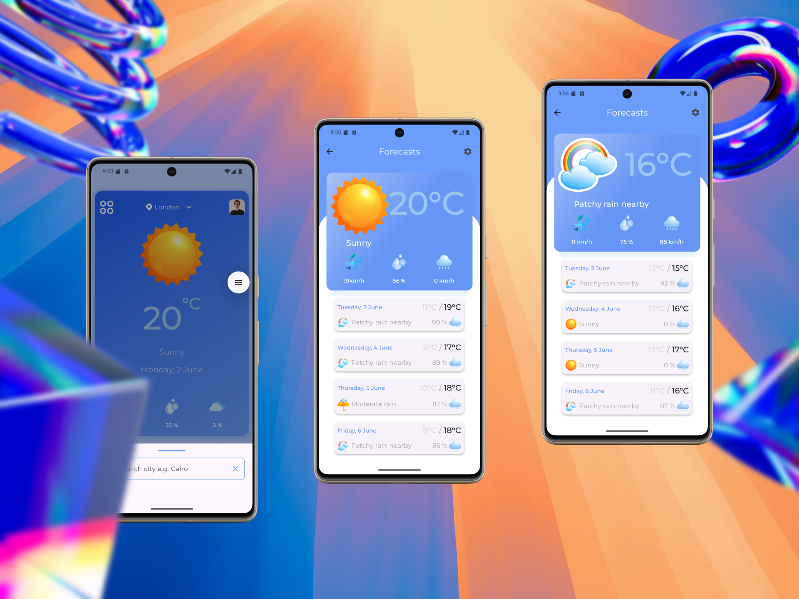

# ☁️ Flutter Weather App

A sleek and intuitive mobile application built with Flutter that provides real-time weather information for any city you search for. Stay updated with current conditions, detailed forecasts, and essential weather metrics to plan your day effectively.

---

### ✨ Features

* **Search by City:** Easily find weather details for any city worldwide using a simple search bar.
* **Current Weather Conditions:** Get instant access to temperature, weather description (e.g., "Sunny," "Cloudy," "Rainy").
* **Detailed Metrics:** View crucial weather data including:
    * **Humidity:** Percentage of moisture in the air.
    * **Rainfall:** Information on precipitation (if available from the API).
    * **Wind Speed:** Current wind velocity.
* **Responsive UI:** A beautiful and adaptive user interface that looks great on various device sizes.

---

### 🚀 Technologies Used

* **Flutter:** Google's UI toolkit for building natively compiled applications for mobile, web, and desktop from a single codebase.
* **Dart:** The programming language used by Flutter.
* **WeatherAPI.com API:** For fetching accurate and up-to-date weather data.

---

### 📸 Screenshots

Here are some screenshots of the WeatherWise app in action:

*(Please replace these placeholders with actual screenshots of your running app. You can link to images hosted online or placed within your repository.)*

#### Home Screen (Current Weather)

#### Home Screen (Current Weather, but different locations)

#### Detailed Weather View

#### Search Results

---

### 🎨 Mockup Screenshots

These mockups illustrate the design and user experience of the app.

#### Mobile Mockup 

---
